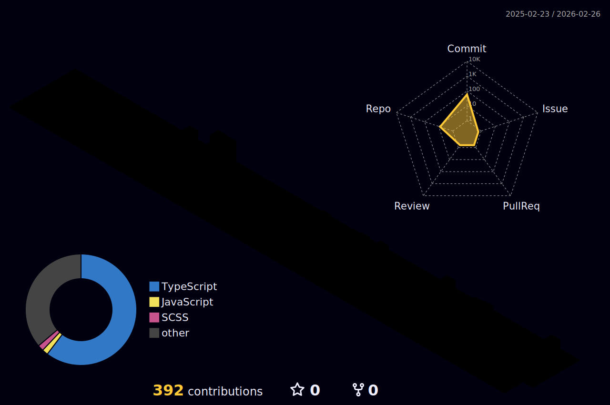

<!-- Futuristic Banner -->

  

<!-- Typing Intro Animation -->

  

---

# ⚡ About Me – *Coding the Future*

> “I don’t just write code — I engineer realities that haven’t happened yet.”

🚀 **Mission:** Build intelligent, secure, and cloud-native systems that adapt to the future.  
🤖 **Specialties:** AI-driven apps, modern web stacks, and resilient cloud architectures.  
🛡️ **Security Vision:** Make the digital world *unbreakable* (ethically 🔐).  
🎯 **Core Belief:** People remember experiences, not just features.  
✨ **Fun Fact:** When my code works first try, I check the simulation for glitches.

---

## 🛠 Tech Arsenal

`Python` · `Java` · `C++` · `React.js` · `Node.js` · `Tailwind CSS`  
`Next.js` · `TypeScript` · `MySQL` · `MongoDB` · `AWS` · `DevOps` · `Linux`

---

## 🚀 Projects & Command Center

### 🩵 [Blinker – Eye Care Web App](https://blinkers.co.in)
SEO-optimized clinic web app – boosted reach by **30%**!

### 🤖 [AI-Powered Counselling System](https://github.com/counselling)
Career guidance + emotional support with **real-time ML**.

### 🏢 Garvi Gala PG Management
Automated rent tracking; efficiency unlocked 🚀.

### 📈 Crypto News & Price Dashboard
Live crypto news and charts for **400+ beta users**.

---

## 📜 Certifications

| 🎖 Certification               | 🏛 Provider        | 📅 Date   | 🔗 Link |
|-------------------------------|-------------------|-----------|---------|
| Foundations of Cybersecurity   | Kennesaw Univ.    | Nov 2024  | [Verify](https://coursera.org/verify/F7NMYB6B6Z63) |
| R Programming for Data Science | IBM               | Nov 2024  | [Verify](https://coursera.org/verify/7OTTS8FQ2VB7) |
| Cybersecurity Capstone         | IBM               | Nov 2024  | [Verify](https://coursera.org/verify/7DHB8AGGIC6P) |
| Security Operations            | ISC2              | Nov 2024  | [Verify](https://coursera.org/verify/5KALFQJQKPQC) |
| DevOps on AWS Specialization   | AWS               | Nov 2024  | [Verify](https://coursera.org/verify/I86AALNHGZW5) |

---

## 📅 Isometric Commit Calendar

  

---

## 📊 GitHub Stats – Real-Time & Futuristic View

  <!-- Neon glow effects for a modern, techy look -->
  

  

  

---

---

## 🎉 Fun Zone

- 🐧 I speak Python, Java, and fluent sarcasm 😏
- 🚀 Debug mantra: `"printf()" + hope`
- 🍍 Pineapple on pizza squad leader forever

---

> ⚡ **Let’s connect & create the future — one commit at a time.**

