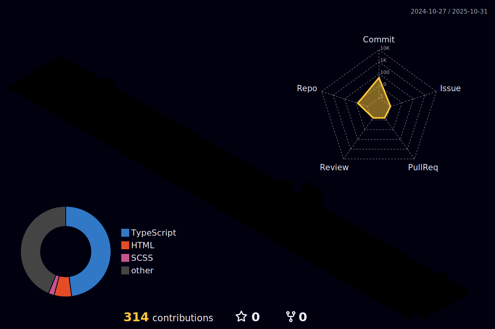

<!-- Futuristic Banner -->

  

<!-- Typing Intro Animation -->

  

---

# ⚡ About Me – *Crafting Tomorrow’s Technology Today*

> “I don’t simply write code — I create digital experiences that inspire and innovate.”

- 🚀 Driven to design smart, secure, and scalable cloud-native solutions.  
- 🤖 Passionate about AI-powered applications, modern web technologies, and robust infrastructure.  
- 🛡️ Committed to strengthening the digital world with top-tier cybersecurity practices (ethically, of course).  
- 🎯 Firm believer that memorable experiences matter far more than mere features.  
- ✨ Fun fact: If my code works perfectly on the first try, I assume pure magic is involved.

---

## 🛠 My Toolbox

Fluent in:  
`Python` · `Java` · `C++` · `React.js` · `Node.js` · `Tailwind CSS` · `Next.js` · `TypeScript` · `MySQL` · `MongoDB` · `AWS` · `DevOps` · `Linux`

---

## 🚀 Projects I'm Proud Of

### 🩵 [Blinker – Eye Care Web App](https://blinkers.co.in)  
A polished, SEO-friendly website for an eye clinic that boosted their patient outreach by **30%**.

### 🤖 [AI-Powered Counselling System](https://github.com/counselling)  
Real-time machine learning-driven platform delivering career advice and emotional support.

### 🏢 Garvi Gala PG Management  
Streamlining rent and tenant management with intelligent automation — boosting efficiency 🚀.

### 📈 Crypto News & Price Dashboard  
Serving 400+ users a real-time, seamless cryptocurrency price and news experience.

---

## 📜 Credentials & Certifications

| 🎖 Certification               | 🏛 Issuer          | 📅 Date   | 🔗 Verify |
|-------------------------------|--------------------|-----------|-----------|
| Foundations of Cybersecurity   | Kennesaw University| Nov 2024  | [Verify](https://coursera.org/verify/F7NMYB6B6Z63) |
| R Programming for Data Science | IBM                | Nov 2024  | [Verify](https://coursera.org/verify/7OTTS8FQ2VB7) |
| Cybersecurity Capstone         | IBM                | Nov 2024  | [Verify](https://coursera.org/verify/7DHB8AGGIC6P) |
| Security Operations            | ISC2               | Nov 2024  | [Verify](https://coursera.org/verify/5KALFQJQKPQC) |
| DevOps on AWS Specialization   | Amazon Web Services | Nov 2024  | [Verify](https://coursera.org/verify/I86AALNHGZW5) |

---

## 📅  GitHub Commit Calendar

  

---

## 📊 GitHub Stats — Fresh, Futuristic & Fun

<!--    -->
  

  

  

---

## 🎉 Fun Zone

- 🐧 I fluently speak Python, Java, and the universal language of sarcasm 😏 
- 🚀 Debug mantra: `"printf()" + a pinch of hope`  
- 🍍 Pineapple on pizza: a hill I’m happily willing to die on 🍕

---

> ⚡ *Let’s connect, collaborate, and build the future — one commit at a time.*

---

## 🔗 Let's Connect

  
  &nbsp;
  
  &nbsp;
  
  &nbsp;
  

